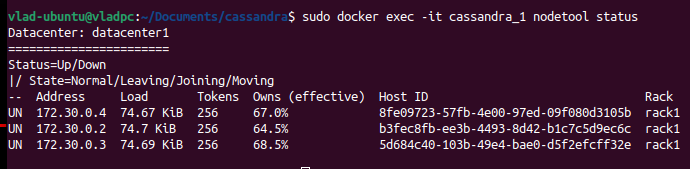
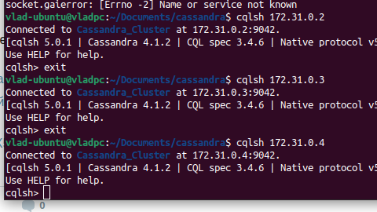
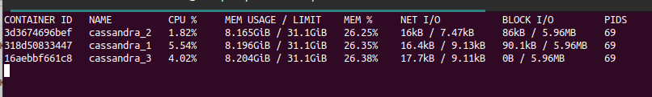

# Тестовое задание
## Создать Docker Compose скрипт для развертки кластера из трех инстансов cassandra, причем каждый из них должен быть доступен из основной (локальной) сети по отдельному ip адресу.

### Для проверки работы скрипта будут полезны следующие команды

`sudo docker compose up -d` - запуск docker compose -d указывает о том что запуск будет произведен в фоновом режиме

`sudo docker compose down` - остановить и удалить конейнеры

`sudo docker exec -it cassandra_1 nodetool status` - Предоставляет информацию о кластере, такую как состояние, загрузка и идентификаторы. Утилита docker exec - выполнение команд внутри контейнера

`docker compose ps -a` - информация о запущенных контейнерах 

`sudo cqlsh 172.30.0.2 -u cassandra -p cassandra` - 'cqlsh' представляет собой интерфейс командной строки для взаимодействия с Cassandra с использованием CQL (язык запросов Cassandra). 
172.30.0.2 - ip адрес инстанса, ключ -u логин, ключ -p пароль

- <b>На данном скриншоте показано что запущено 3 инстанса cassandra и каждый имеет свой ip адрес<b> 
  
  
  
- <b>На данном скриншоте показано что каждый из инстанов доступен через утилиту cqlsh<b>

  
  
  
- <b>На данном скриншоте показана нагрузка на cpu, потребление памяти каждым из иснстансов<b>

  